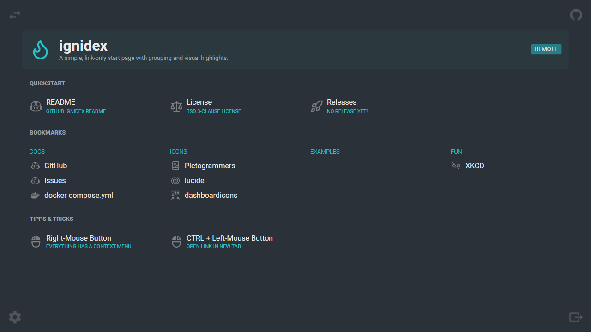
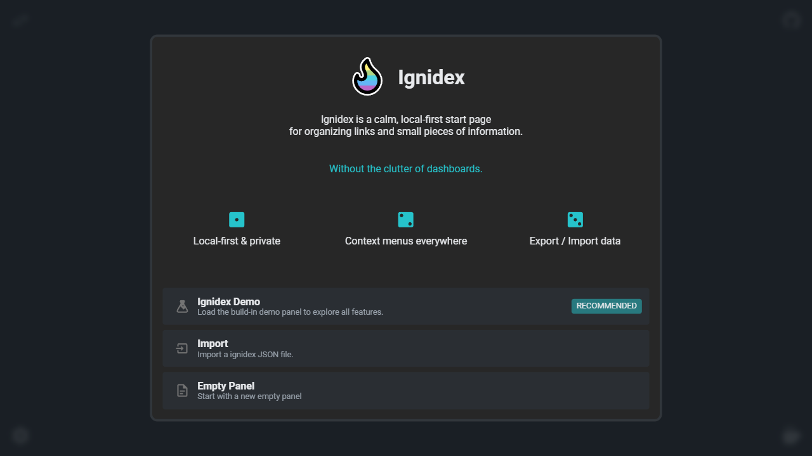
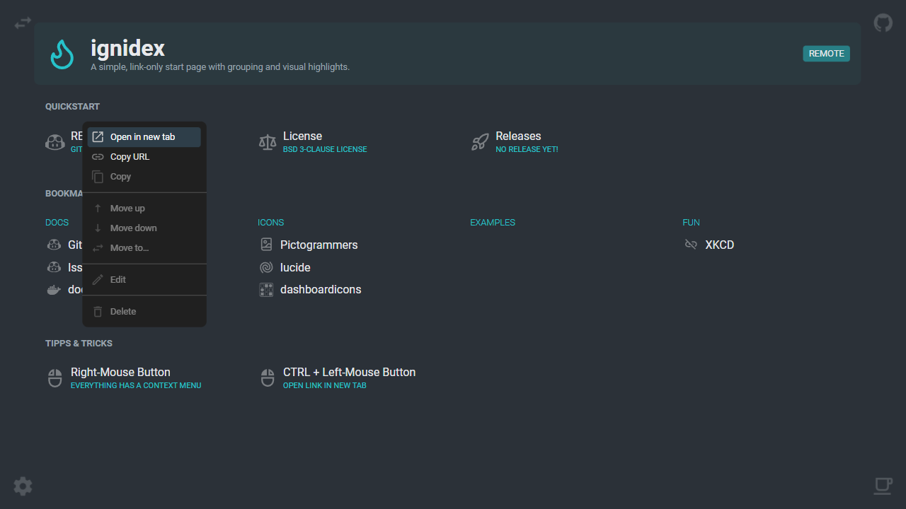
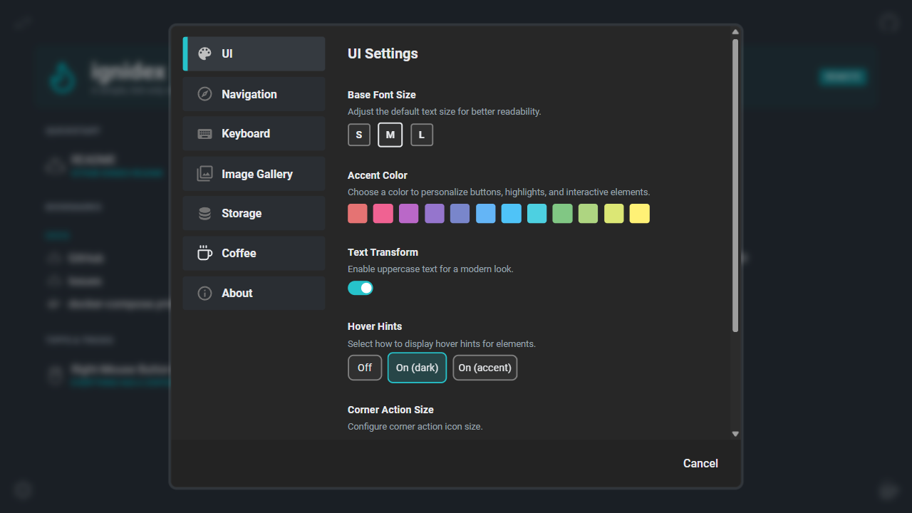

<h1 align="center">
<picture>
    <source srcset="./public/favicon.svg">
    
</picture><br>
Ignidex
</h1>

<p align="center">
<strong>A personal start page for links, actions, and small checklists.</strong>
</p>

<p align="center">
  <a href="./LICENSE"></a>
  <a href="https://github.com/zeitport/ignidex/releases"></a>
  <a href="https://github.com/zeitport/ignidex/pkgs/container/ignidex"></a>
  
  
</p>


Ignidex is a local-first page you open *before* everything else. A calm, fast index for the things you access frequently.


<h2 align="center"><a href="https://ignidex.eu"><strong>Try it live</strong></a></h2>


<p align="center">
  <video src="https://github.com/user-attachments/assets/001fa020-384c-42b4-b0e8-bf834137be04" width="720" autoplay loop muted>
  </video>
</p>

## ⚡ Free hosted version

**[ignidex.eu](https://ignidex.eu)** — Use Ignidex directly in your browser.

- Public hosted instance
- No installation required
- No account needed, no cloud, no sync
- No tracking, no telemetry, no external network requests
- Not a metrics, widget, or analytics dashboard — just action panels and links.
- Everything stored locally (indexdb)
- Open source, permissive license
- Same code as the local version.

## Screenshots

<table>
  <tr>
    <td align="center">
      <strong>Start Panel</strong><br>
      
    </td>
    <td align="center">
      <strong>Getting Started</strong><br>
      
    </td>
  </tr>
  <tr>
    <td align="center">
      <strong>Context Menu</strong><br>
      
    </td>
    <td align="center">
      <strong>Settings</strong><br>
      
    </td>
  </tr>
</table>

## Features

Organize your most-used links into a single page you open every day. Export and share your setup as a portable JSON file.

See **[Features](./docs/features.md)** for full details.

## Self-Hosting

Run Ignidex on your own server with Docker.

```bash
curl -O https://raw.githubusercontent.com/zeitport/ignidex/main/docker-compose.yml
docker compose up -d
```

Access at `http://localhost:4280`

See **[Self-Hosting Guide](./docs/selfhost.md)** for HTTPS setup, custom panels, and production deployment.

## What Ignidex Doesn't Do

Ignidex intentionally avoids:

- Charts, analytics, or dashboard widgets
- Project management or task tracking
- Accounts, sync, or external services
- Automation or scheduled jobs

If you need these, use a different tool. Ignidex is for **starting**.


## Design Principles

| Principle | Description |
|-----------|-------------|
| **Local-first** | Data stays on your machine. No accounts. No tracking. |
| **Minimal** | Few concepts. Clear behavior. Low configuration surface. |
| **Calm UI** | Works quietly. Easy to use, easy to ignore. |
| **Stable** | Feature-complete is a valid end state. |

Read the full **[Philosophy](./PHILOSOPHY.md)** for design rationale.

## Privacy & Security

Ignidex is local-first and performs no external network requests by default.
A **free** hosted version is available at https://ignidex.eu

Read the full **[Privacy Policy](./PRIVACY.md)** for details.

## Who This Is For

- Anyone who wants a clean start page without complexity
- Developers and power users
- Self-hosters and privacy-conscious users

## Status

Ignidex is in active development.

## License

- Code: BSD 3-Clause License
- Examples: [LICENSE INFO](./public/examples/LICENSE)

## FAQ

If you have questions about design decisions, privacy, hosting, 
or how Ignidex differs from dashboards and bookmarks, see the [FAQ](./docs/FAQ.md).

---

<p align="center">
  <a href="https://ignidex.eu">ignidex.eu</a>
</p>
